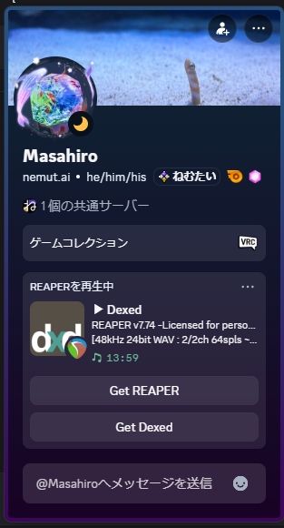

# REAPER → Discord Rich Presence

Shows "working in REAPER" on your Discord status while REAPER is open. No Node.js, no user token — just a single Go executable and one REAPER Lua script. Windows only.


## Features

- One resident process (the exe). No Node, no background server.
- Uses the official Rich Presence IPC — no user tokens, no self-bot.
- Shows the top FX on the selected track. Register your go-to plugins to give each its own icon and a button to its download page.
- Switches to "idle" after a stretch with no input or sound, and snaps back the moment you play again.
- Every line of the card is configurable from a JSON file.
- Never sends your project's file name.

## Example



*A customized profile (listening layout, audio caption, a per-plugin download button). Out of the box it's simpler:*

```
Playing REAPER
v7.74 · 48kHz · 128spls · 2.2/3.0ms
▶️ Serum · 128 BPM
```

Each line is a template you can rewrite (see [Configuration](#configuration)). The card also carries the REAPER icon (or a registered VST's icon), an elapsed timer, and buttons. The "REAPER" on line 1 is the Discord app name, so whatever you call the app in the Developer Portal is what shows.

## How it works

The Lua script only writes REAPER's state to a JSON file; the exe does all the Discord talking. They're decoupled through that one file.

```
REAPER starts
└─ Scripts/__startup.lua
   └─ reaper_discord_presence.lua    writes state to JSON, launches & watches the exe
      └─ %APPDATA%\REAPER\reaper_discord_presence.json
         └─ reaper-discord-presence.exe    reads the JSON, sends it over Discord's local IPC
```

Rich Presence goes through the desktop Discord client's local IPC, so a resident sender process is unavoidable — this keeps it to one small Go exe. If the exe dies, the Lua side notices and relaunches it, so it recovers on its own as long as REAPER is open. If the JSON stops updating, the exe assumes REAPER closed and clears the status.

## Requirements

- Windows 10 / 11
- Discord desktop app (the browser version has no IPC)
- REAPER
- One Discord Developer Portal application

## Setup

### 1. Create a Discord application

In the [Discord Developer Portal](https://discord.com/developers/applications), create a New Application and name it `REAPER`. That name becomes the "REAPER" in "Playing REAPER". Copy the **Application ID** from **General Information**.

### 2. Upload images

Under **Rich Presence → Art Assets**:

- Large image: key `reaper` (lowercase), the REAPER icon.
- State badges (optional): keys `play` / `pause` / `record` / `stop`. With these, a small badge follows the transport state. It works fine without them — you just don't get the badge.

Use PNGs, 512×512 or larger. Uploads can take a few minutes to appear.

### 3. Get the exe

- Download `reaper-discord-presence.exe` from [Releases](../../releases), or
- Build it: install [Go](https://go.dev/dl/) and run `./build.ps1`. You get a static, single-file exe with no console window.

### 4. Install

Drop both files into REAPER's Scripts folder:

```
%APPDATA%\REAPER\Scripts\reaper-discord-presence.exe
%APPDATA%\REAPER\Scripts\reaper_discord_presence.lua
```

Add one line to the end of `%APPDATA%\REAPER\Scripts\__startup.lua` (keep anything already there):

```lua
dofile(reaper.GetResourcePath() .. "/Scripts/reaper_discord_presence.lua")
```

### 5. Configure

The first run creates `%APPDATA%\REAPER\reaper_discord_presence_config.json`. Set `clientId` to the Application ID from step 1. The rest is in [Configuration](#configuration).

### 6. Check it

Start the Discord desktop app and REAPER. `Playing REAPER` appears within a few seconds. Playing, stopping, recording, and tempo changes update the card; closing REAPER clears it within a few seconds.

## Configuration

| Key | Default | Description |
|------|--------|------|
| `clientId` | — | Discord Application ID (required) |
| `largeImageKey` | `reaper` | Art Asset key for the large image |
| `largeImageText` | `""` | Caption for the large image (templated, e.g. `REAPER v{ver}`). Empty falls back to the title-bar string. Shows as a visible line in the `listening` layout |
| `activityType` | `playing` | Line 1 verb: `playing` / `listening` (→ Listening to) / `watching` / `competing`. RPC only honors these four |
| `pollIntervalMs` | `2000` | How often (ms) to read the status JSON |
| `staleAfterMs` | `60000` | If the JSON isn't updated for this long, REAPER is treated as closed. Defaults to 60s so a plugin-load hang doesn't clear it. A clean quit clears immediately (the Lua removes the status file) |
| `awayAfterMs` | `600000` | Switch to "idle" after this long with no input or sound (10 min). `0` disables it |
| `awayText` | `Idle` | Text shown while idle (e.g. `Idle`) |
| `awayImageKey` | `""` | Large image while idle. Empty uses `largeImageKey` |
| `resetTimerOnAway` | `true` | Elapsed-timer behavior. `true`: idle shows the idle duration, returning restarts from 0. `false`: one continuous timer from the session start that runs through idle |
| `detailsFormat` | `v{ver} · {srate} · {bufsize} · {latency}` | Line 2 template (below) |
| `stateFormat` | `{emoji} {fxOrTransport} · {bpm}` | Line 3 template (below) |
| `showElapsed` | `true` | Show the elapsed timer |
| `smallImageByTransport` | `true` | Show a small transport badge (needs `play`/`pause`/`record`/`stop` assets) |
| `swapImages` | `false` | Swap the large and small art (VST/state icon large, REAPER as the small badge) |
| `vsts` | `[]` | Plugin table (below) |
| `button1Label` / `button1Url` | `Get REAPER` / reaper.fm | Button 1. Empty hides it |
| `button2Label` / `button2Url` | `""` | Button 2. Empty hides it |

Buttons are only visible to other people viewing your profile, not to you (icons and the text lines are visible to you). The project file name is never sent.

### Display templates (`detailsFormat` / `stateFormat`)

Lines 2 and 3 are driven by the template strings in the config. Available placeholders:

| Placeholder | Value |
|------|------|
| `{title}` | Title-bar string (e.g. `REAPER v7.74 -Licensed ...`). Read from the window title |
| `{version}` | Version with arch (e.g. `7.74/x64`) |
| `{ver}` | Version without arch (e.g. `7.74`) |
| `{emoji}` | Transport emoji (▶️ / ⏸️ / ⏺️ / ⏹️) |
| `{transport}` | Transport word (Playing / Paused / Recording / Stopped) |
| `{fx}` | Top FX on the selected track (registered name if registered, else empty) |
| `{fxOrTransport}` | `{fx}` if present, else `{transport}` |
| `{bpm}` | Tempo (e.g. `128 BPM`, empty if none) |
| `{srate}` | Sample rate (e.g. `48kHz`) |
| `{bufsize}` | Block size (e.g. `128spls`). There's no ReaScript API for it, so it's read from `reaper.ini` — i.e. it updates when you save your audio prefs, not live |
| `{latency}` | I/O latency (e.g. `2.2/3.0ms`) |
| `{bps}` | Bit depth (e.g. `24bit`) |
| `{channels}` | I/O channel count (e.g. `2/2ch`) |
| `{driver}` | Audio driver (e.g. `ASIO`) |

Empty placeholders vanish. Use `·` (middle dot) as the separator and empty segments collapse together with the surrounding `·` (e.g. `{emoji} {fxOrTransport} · {bpm}` with no tempo → `▶️ Serum`). Other separators aren't collapsed.

Examples:
- `"stateFormat": "{transport} · {bpm}"` → `Playing · 128 BPM`
- `"stateFormat": "{fx}"` → `Serum`
- `"detailsFormat": "REAPER {version}"` → `REAPER 7.74/x64`

### Plugin registration (`vsts`)

When the top FX on the selected track contains a registered name, it can show a dedicated icon (small badge) and a button to the download page.

```json
"vsts": [
  { "match": "Serum", "label": "Serum", "imageKey": "serum", "downloadUrl": "https://xferrecords.com/products/serum" }
]
```

| Field | Description |
|------|------|
| `match` | Matches if contained in the FX name (case-insensitive) |
| `label` | Display name |
| `imageKey` | Art Asset key for the small badge (upload that VST's logo separately). Optional |
| `downloadUrl` | Sets button 2 to "Get &lt;label&gt;" pointing here. Optional |

On a match, the small badge prefers the registered icon (otherwise the transport badge), and button 2 becomes that VST's download link.

## Troubleshooting

**Nothing shows up**
- Is the Discord desktop app running? (the browser version won't work)
- Is `clientId` correct?
- To let others see it, turn on Discord's **Settings → Activity Privacy → "Display current activity as a status message"**.
- Check the log at `%APPDATA%\REAPER\reaper_discord_presence.log`.

**No image, or the default image**
- Make sure the Art Asset key is `reaper` (lowercase). Fresh uploads take a few minutes to propagate.

**Goes idle on its own, or won't come back**
- Going idle after a stretch with no input or sound is intended (`awayAfterMs`). Set `0` to disable it, or raise the value. Playing or any action brings it back.
- If it doesn't clear after you quit REAPER, lower `staleAfterMs`.

## Logs

It's built for the GUI subsystem, so there's no console output. It writes to `%APPDATA%\REAPER\reaper_discord_presence.log` instead.

## License

[MIT](LICENSE)
